# Body Measurement

Body measurement is a collection of 9 sections. Those sections are:
  * weight
  * bmi
  * waist circumference 
  * blood sugar 
  * height 
  * blood pressure 
  * oxygen saturation 
  * pulse 
  * temperature 

For demonstration purpose we will show any one of section in the following documentation but it will be same for other sections also.

## Right card
There is **no right card** for body measurement. 

## Left card
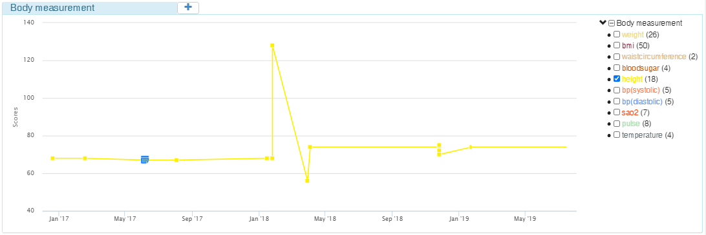

left card consists of mainly two sections, a chart and a tree-view beside the chart. Initially graphs for all sections are seen in chart and all checkboxes are checked. Each items of tree-view is associated with a line graph of chart and checking on/off will make the graph visible or hidden in chart. Also same color code are being used to find the association easily.

### Tree view
Under body measurement all the 9 sections can be seen, but "blood presure" has been divided into 2 seperate sections, "bp(systolic)" and "bp(diastolic)". Thus total 10 sub-sections can be seen under the tree view.

Each section has a number at the end which denotes the number of data in the record.

### Chart
X-axis represents date and Y-axis represents score/value whichever is neaningful for a perticular data. 

### Tool-tip
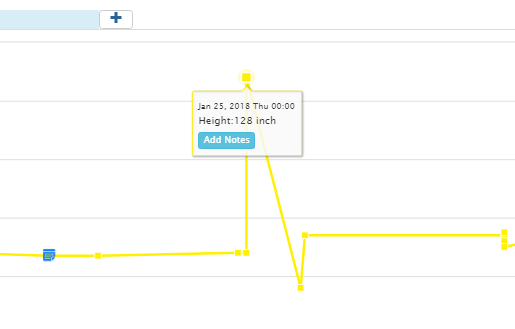
Each node of a graph has tool-tip and in that tool-tip data such as section name, measuring date etc can be seen. Above pic is an example of tool-tip where no note is added for that node.

Following pic is an example of tool-tip that has note data for the related node. 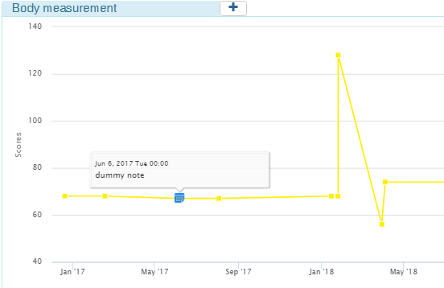
Clicking on that tool-tip will show some more info about the note. Refer this pic: 
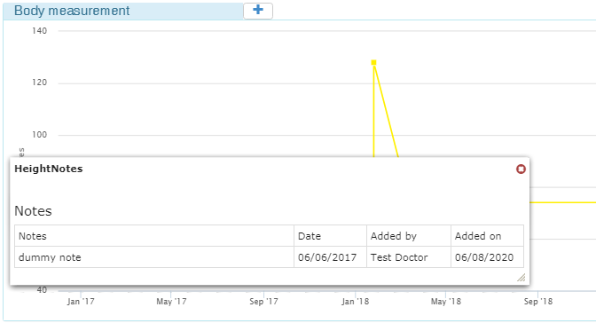

### Adding a note to a data/node of graph:
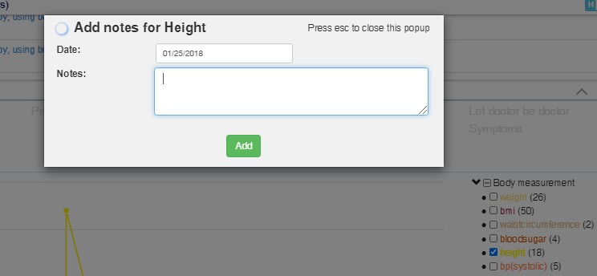
This is an example of add note form for a perticular data of height graph. As you see in the earlier pics, there is an add button in the tooltip. Clicking on the button will open this form.

### Body meadurement add feature:
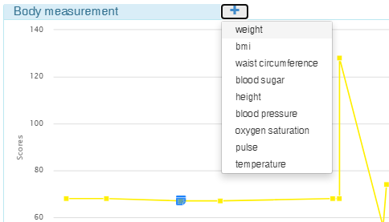
In the header section there is a plus sign, clicking which will open a dropdown consisting of all the 9 sections of body measurement.
Further clicking on any of the section, eg: "weight" will open corresponding add form. 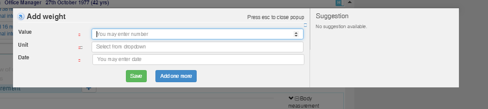 
Submitting the add form will push a node to the respective graph instantly.

Following pics are of add forms of 8 other sections. It will help to understand what kind of forms, fields or data we are collecting for those sections.
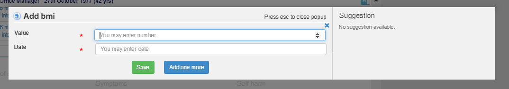
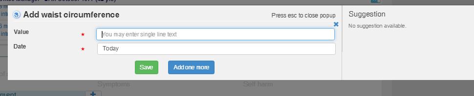
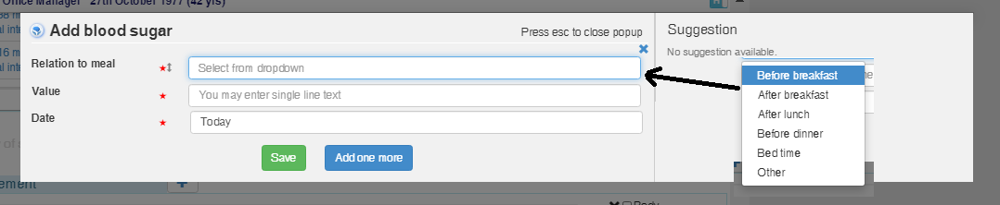
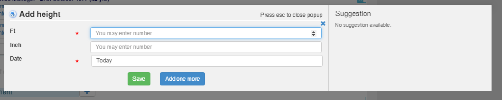
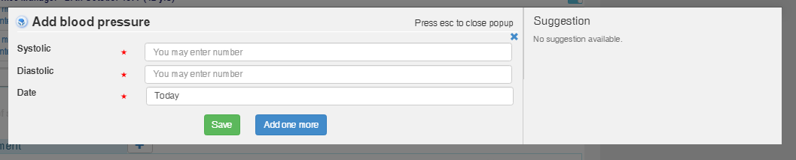
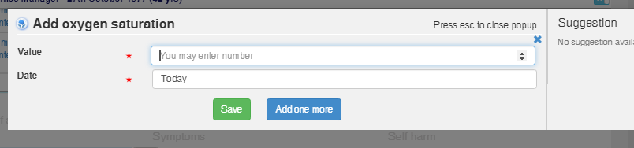
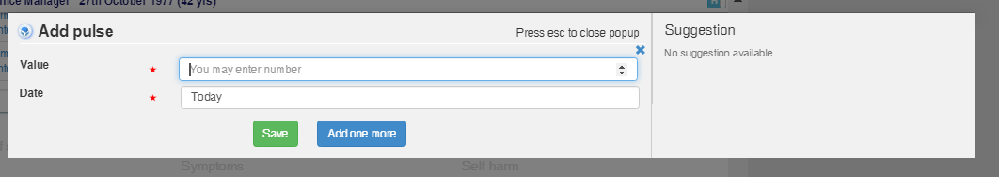
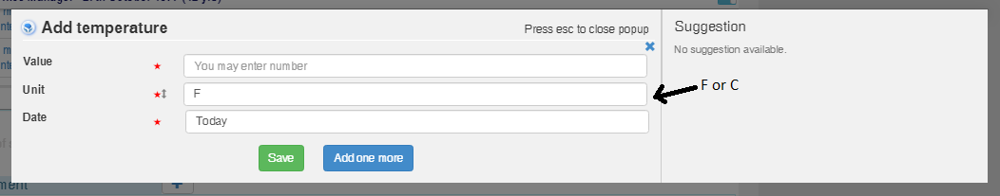