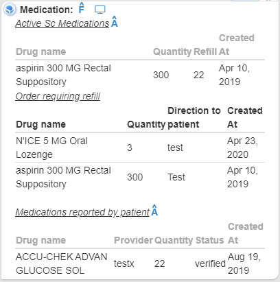
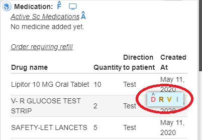
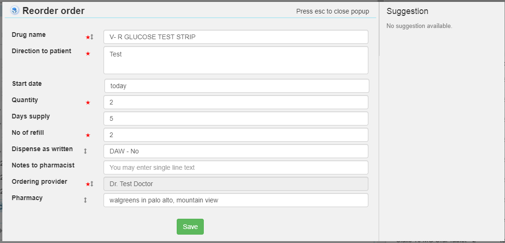
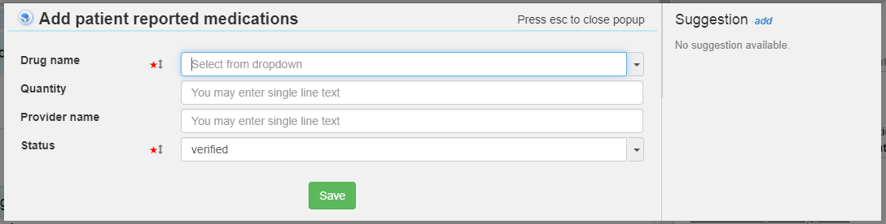

# Medication 

DB name: DB_SC_Pharmacy_CT_V20
------------------------------
Importent points to notes about medication:
------------------------------------------

Need to understand about following fields: 

1. Drug name: name of medicine. Respective field will be typeahead drop-down and data will come from: Table: masterMedicineByDIT field 'drugName'.
2. Start date: 
3. Quantity:
4. No of refils:
5. days supply:
6. Pharmacy
7. Status

Left card
------------

----------------------------------- 

Right card
-----------

-------------------------------------------
1. Hovering on medication

2. Clicking on 'R' (Re-order medication)

3. Clicking on 'V'

----------------------------------- 

2nd layer - add active sc medication - popup 1
----------------------------------------------

Ordering provider field should be auto selected by loggedin doctor and disabled.

----------------------------------- 

2nd layer - add active sc medication - popup 2
----------------------------------------------

----------------------------------- 

2nd layer - add patient reported medication
-------------------------------------------

----------------------------------- 

