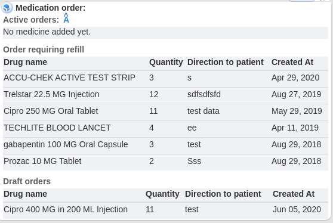
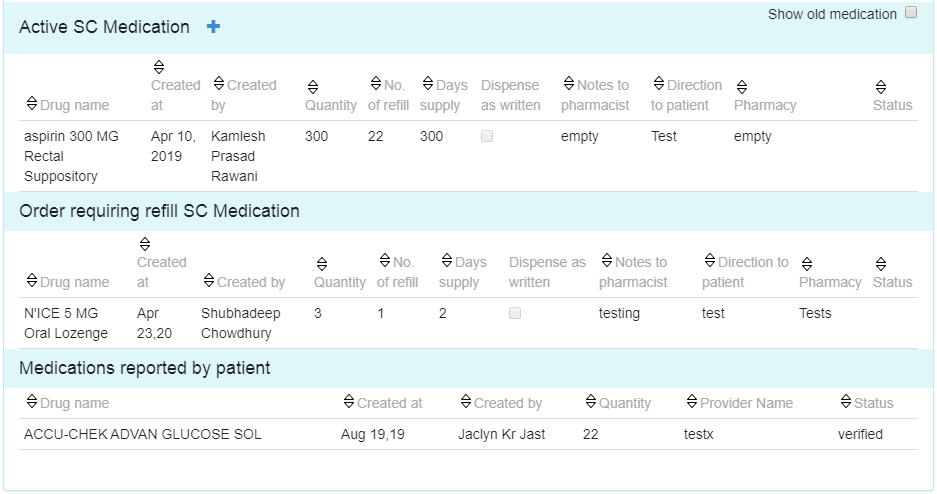
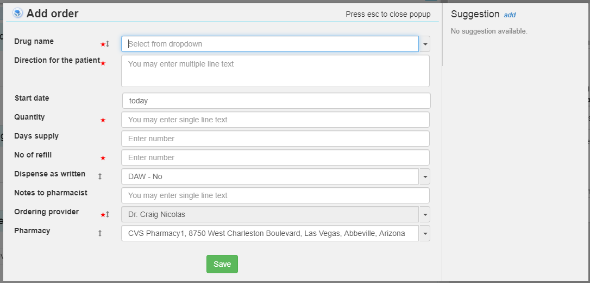
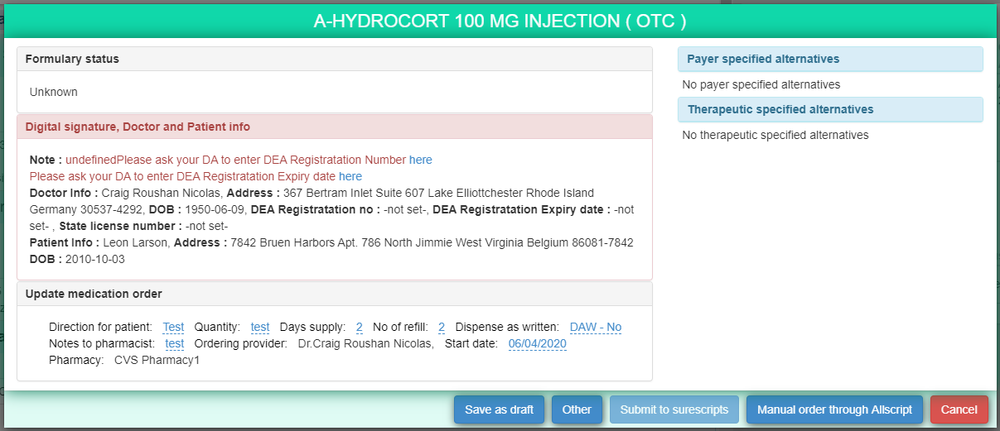
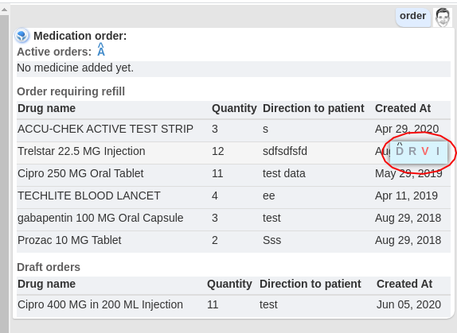
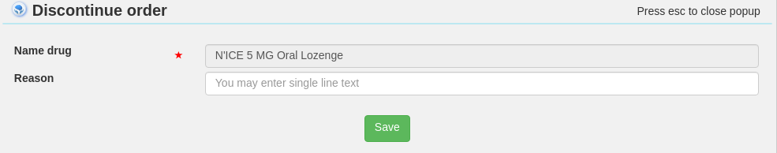
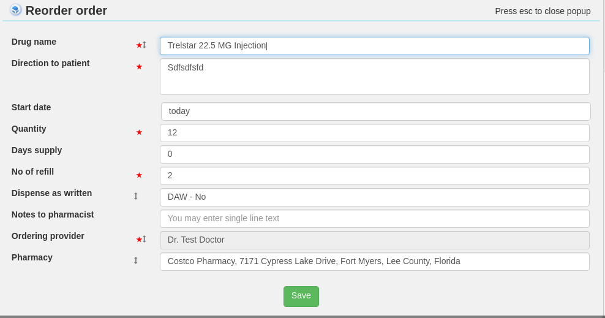
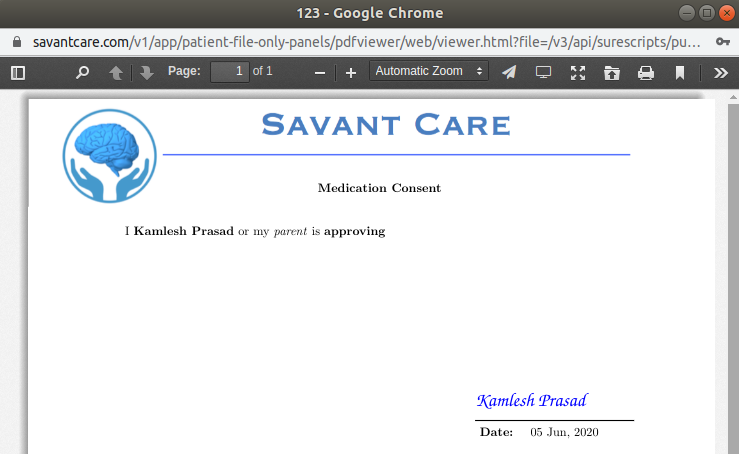
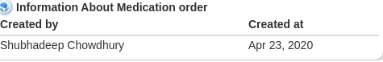

# Medication order

DB name: DB_SC_Meds_and_Refill_CT_V20
------------------------------

Importent points to notes about medication:
------------------------------------------

 By searching the 'order' in sc-brain search box it will show the following right box 'Medication order' card, also open the left 'Medication order panel' in right

Right card
-----------

There will be 3 types of medication list the the left card

* Active orders: --- active medication currently taken by patient
* Order requiring refill: --- medication which is require refill by provider
* Draft orders: --- Medication which is currently added and not prescribed to the patient by any 3rd party vendor.

Left card
------------

There will be 4 types of medication list the the right card

* Active orders --- active medication currently taken by patient
* Orders requiring refill --- medication which is require refill by provider
* Discontinued orders --- mdecation which is stopped/discontinued by provider.(by pressing 'D' icon)
* Cancelled orders --- medications which is cancelled by provider.

-----------------------------------------------------------

Clicking on 'A' icon in left card header will show a 2nd layer popup to add sc medication

Field Info :

Need to understand about following fields: 

1. Drug name: name of medicine. Respective field will be typeahead drop-down and data will come from: Table: masterMedicineByDIT field 'drugName'.
2. Direction for the patient: note for way of medication to be taken
3. Start date: Starting date of medication
4. Quantity: No of quantity of medication
5. No of refils: No of reoccuring medication courses
6. days supply: time period of the medication
7. Dispense as written : field required by Provider,
Option1 : DAW - No, Option2 : DAW - Yes
8. Pharmacy: auto-complete LOcal pharmacy list of the patient

Note : Ordering provider field should be auto selected by loggedin doctor and disabled. The filed will be active for role 'Doctor's admin(DA)' and need to provide the doctor's name in the dropdown.

After adding the mdedication in DB the 
hte medication by default stored in DB as 'Draft medication'and a popup2 will open to perform any operation to the medication.

1. Option1: Save as draft, (Not active medication)
2. Option2: Manual order through Allscript (submit to 3rd party vendor to send mdication to patient via local pharmacy and the medication will be marked as a 'active meidcation')
3. Option3: Cancel (Cancel the medication)
4. Option4: Submit to surescripts (Upcoming process to e-prescribe meication)

2nd layer - add active sc medication - 

----------------------------------------------------

### 1. Hovering on medication will show 4 icons D,R,V,I

### 2. Clicking on 'D' (Discontinue medication) will show the followng popup 
to provide the Reason

### 2. Clicking on 'R' (Re-order medication)
The form is same as add medication form with pre-mentioned medication name

### 3. Clicking on 'V'
It will show the medication concent doc by the patient in a saperate window.

### 4. Clicking on 'I'
It will show provider information for the medication. e.g.

