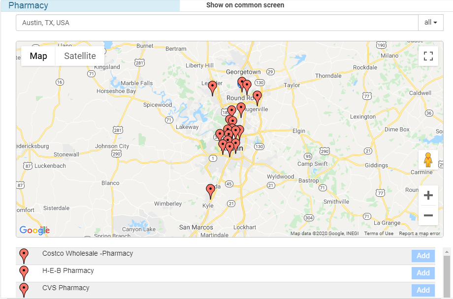
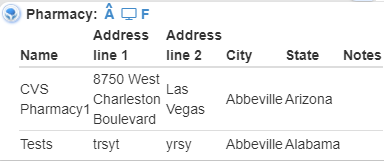
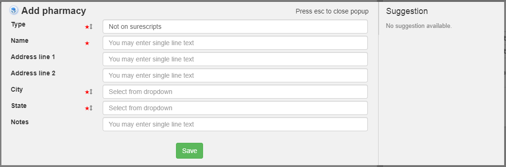
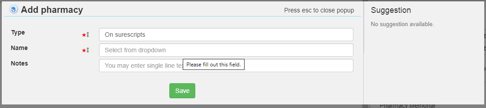

# Pharmacy 
Left card
------------

There is a option to search pharmacy using google map and add to the patient's pharmacy card

----------------------------------- 

Right card
-----------

----------------------------------- 

2nd layer - add pharmacy 
----------------------------------------------
Type is a dropdown having two option
1. If option 1(Not on surescripts) is selected

2. If option 2(On surescripts) is selected

